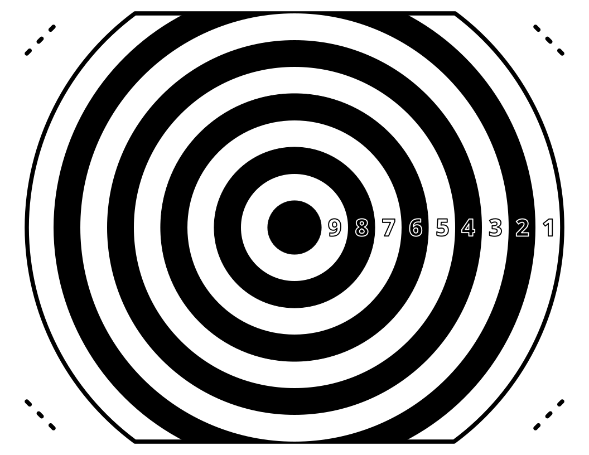
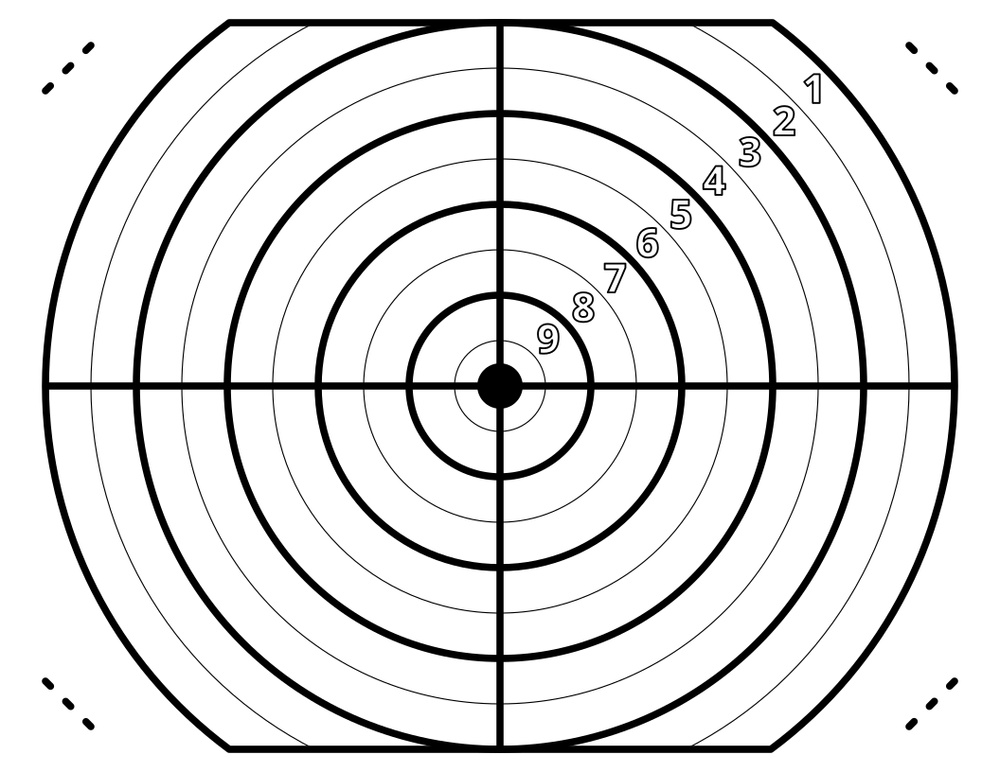

# Printable Targets

Home made US letter (8.5" x 11") sized printable targets.

Staple/tape guide locates around each corner.

No watermarks, feel free to use or modify youself!

## License

Target design is under MIT license.

Font license page: [font license](https://fonts.google.com/noto/specimen/Noto+Sans/license).

## Drawing Software

[Inkscape](https://inkscape.org/)

## Font

The font for the scores is [Google Noto Sans](https://fonts.google.com/noto/specimen/Noto+Sans), it is free & open source.

## Preview

### Striped Bullseye

### Gridded Bullseye

